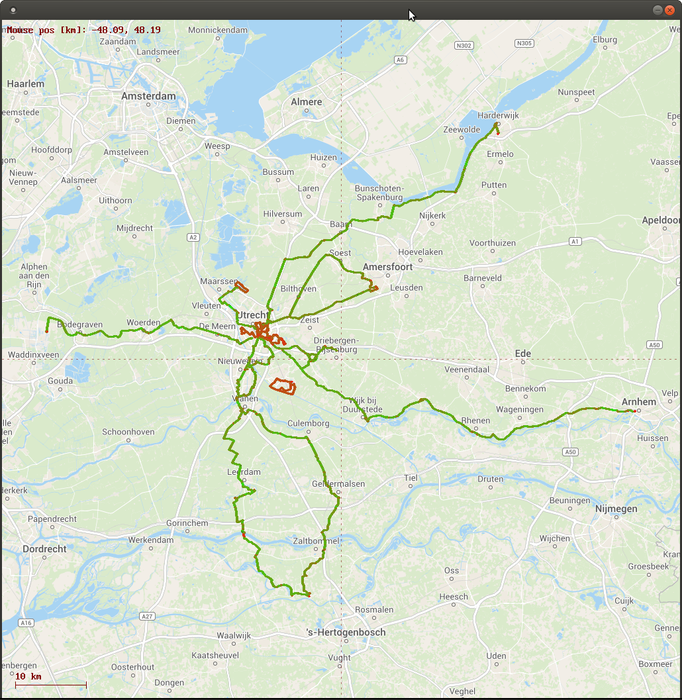
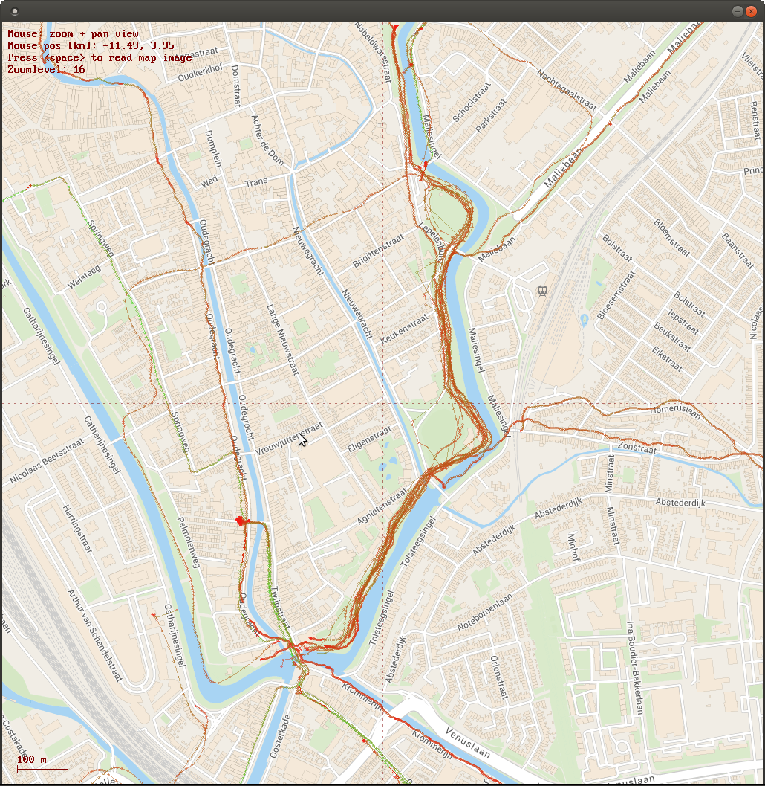

# gpx_track_plotter
Plots tracks in GPX format on maps downloaded from Thunderforrest

Uses:
- libxml2 (http://xmlsoft.org/)
- SNC (https://www.freebasic.net/forum/viewtopic.php?f=7&t=23421)
- FBImage (https://www.freebasic.net/forum/viewtopic.php?t=24105)
- Thunderforrest (https://www.thunderforest.com/)

Example output:

